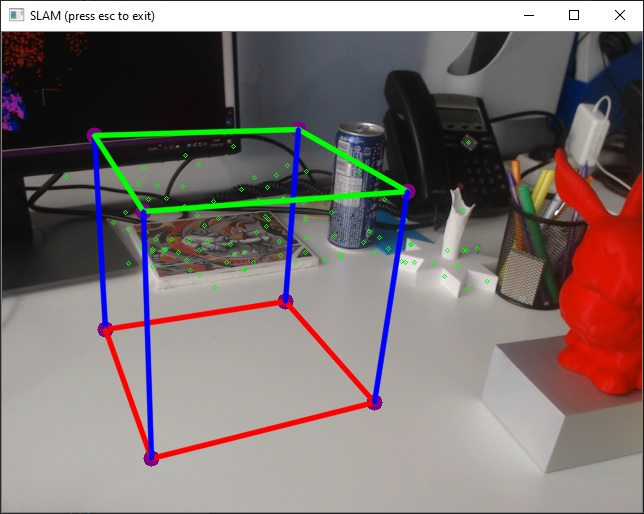

# SolAR Sample SLAM

The SolAR **SLAM samples** show a SolAR pipeline for augmented reality based on a SLAM (Simultaneous Localization And Mapping).

|   |  |
|:-:|:-:|
| StandAlone/Multithread | Plugin | 

## How to run

* :warning: Don't forget to download the [fbow vocabularies](https://github.com/SolarFramework/binaries/releases/download/fbow%2F0.0.1%2Fwin/fbow_voc.zip) unzip this archive and put the `akaze.fbow` in your working directory.

* SolAR SLAM samples require a fiducial marker to initialize. So you need to print the [FiducialMarker](./Mono/FiducialMarker.gif) and put it into the scene.

* If you want to change your fiducial marker, you can edit the [fiducialMarker.yml](./Mono/fiducialMarker.yml).

* If you want to change the calibration parameters of the camera, edit the [camera_calibration.yml](./Mono/camera_calibration.yml).

* To change properties of the components of the SLAM pipeline, edit the [conf_SLAM.xml](./Mono/conf_SLAM_Mono.xml) file.

### StandAlone/Multithread

* Open a terminal and execute :
    * `./bin/Release/SolARSlamSampleMono.exe`  
    (showing a mono thread demonstration of the SolAR SLAM.)

    * `./bin/Release/SolARSlamSampleMulti.exe`  
    (showing a multi-thread demonstration of the SolAR SLAM.)

   * `./bin/Release/TestSlamPlugin.exe`  
    (showing an application loading the SLAM pipeline embedded into a dedicated SolAR Module.)

*  When the application is started, point the camera to the fiducial marker (you can see a virtual cube on the marker).

* Then move the camera around the fiducial marker (recommend moving left and right) to initialize the SLAM. The initialization is successful when appearing green points in the image.

* :warning: If the initialization is still not successful after a few seconds (This is normally due to texture-less scenes), you can add some objects into the scene and restart.

* Now you can move the camera freely. The SolAR SLAM can track the camera pose and at the same time, you see in a dedicated window the 3D point cloud reconstructed by the SLAM (only for SolARSlamSampleMono.exe and SolARSlamSampleMulti.exe). Note that the fiducial marker is only used for the initialization, it can be removed from the scene later.

* :warning: In the case of lost tracking, you can return the camera to the previous views to relocalize camera pose instead of restarting.

* Press `escape` to quit the application.

### Plugin

You should have bundle every required library in your Unity project (`./Assets/Plugins`). Then from Unity Gameobject *PipelineLoader* you can load your configuration file for the SLAM pipeline. You can directly edit parameters from Unity Editor's inspector.

:warning: Don't forget to download the [fbow vocabularies](https://github.com/SolarFramework/binaries/releases/download/fbow%2F0.0.1%2Fwin/fbow_voc.zip) unzip this archive and put the `akaze.fbow` in your `./Assets/StreamingAssets/SolAR/FBOW`.

## Contact 
Website https://solarframework.github.io/

Contact framework.solar@b-com.com

